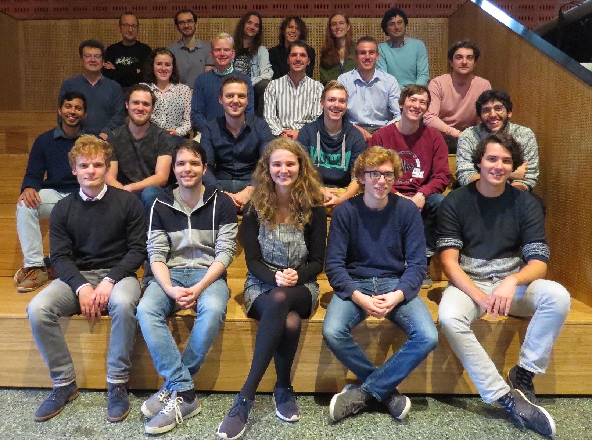
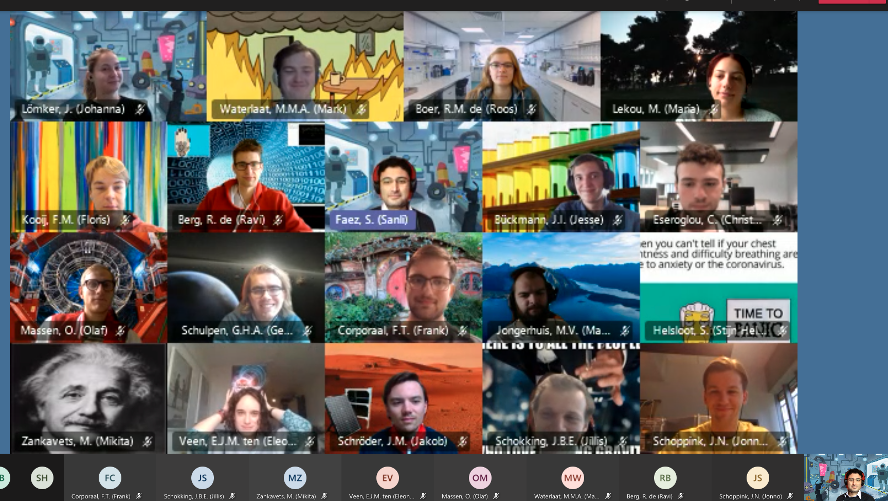

# Welcome!

You find yourself at the front page of the Utrecht Experiment Design course documentation, edition 2023. 

Welcome! :confetti_ball: :heart_eyes: :smile: :confetti_ball:

Instruction and resources for following this course have been collected in this repository, either as as content or with a link. If you miss something or have a suggestion for improving the content, please send an email to the course coordinator.

## A message from the course coordinator
 
I am thrilled to be your host in the forth edition of the Utrecht Experiment Design (UED) course. 
My name is Sanli and my goal is to make this course the most memorable one in your program, even (and especially) after many years.

Part of the course syllabus is similar to other practical courses you have seen in the past. 
You will set up some measurements, gather data, write analysis code, and report your results. 
Some other parts might seem a bit unusual at first (e.g. community interactions, story-telling, value exchange), but I hope that by the end of the course, they will all make sense to you. 
This is a project-based course but we have regularly (guest) lectures and meet ups, which happens on Thursday in the Minneart 0.04, starting on September 14th. Most of the course instructions and assignments will be shared via the course repository on gitlab, for which you will recieve a separate invitation. The major anouncements will also be posted on the Blackboard.

Remember, the main goal of this course is to empower you (plural) to be a distinguishable cohort of experimental physics students. 
Making measurement setups that work and reporting on your experiences are only means to this goal.

### A short bit of UED history 

In 2019, UED was run for the first time. 
I had to make a good deal of planning only based on intuition. 
We had many engaging and constructive discussions and built part of the course structure with the students. 
Luckily, the πoneers cohort, their mentors and the involved experts at the Physics department, told me they had an overall positive experience, and blessed me with well-intentioned constructive feedback. 
The course ended with a festive poster presentation. 
We even had cake and everyone seemed to be very pleased. 
Some of those students became mentors for the following year. 

*Group photo with the "πoneers"*

In 2020, we were hit by the covid19 pandemic. 
Even though it was the second edition, we had to restructure some parts of the course to match it with the hybrid structure. 
We also had to rely on a virtual final symposium, which was much less fun. 
On the positive side, the Quaranteam cohort had an easier time with online collaborations and proper written documentation of the process, as they must. 
We used gitlab issues and the MS Teams environment more effectively. 
In order to encourage the collaboration, despite the imposed physical distances, we tried the idea of a grand project, discussed and chosen by the students in a democratic way. 
Without a final presentation kick, unfortunatley, we could not end on a note as high as the previous year. 

*Group photo with the "Quaranteam"*

The students of 2021 were lucky again that the course was fully in person. 
We continued with using a grand project, the [FAIR-Battery challenge](https://fairbattery.dev), as the binder for the smaller projects that each team was choosing. As a result of this choise, the general lectures on experimental "breakthroughs" and main techniques were no more relevant. 
We only had one introductory lecture on the working principles of redox-flow batteries and one technical lecture on coding interfacing with hardware. 
The students learned the rest from their own initiatives.
Having the grand project encouraged the teams to communicate more between themslved and learn from each others projects. 
However, the duration of the course was too short to reserve sufficient time for merging the individual projects and practice harmonization. 
Some groups were thus less excited about their projects than the rest, as they felt some distance with the project goals, (and Physics students seem to really dislike Chemistry).

*Group photo with the "Flower Power"*

Without the aggregation step, there seems to be little benefit in limiting the project choices to a few that can be counted as part of the grand challenge.
Therefore, in the forth edition, we stepped back to choosing separate team projects. 
Unlike the first cohort, project choices in 2022-23 were not completely free, and were based on reproducing a published open hardware. 
This extra limitation is imposed after observing the anxiety experienced by some students when they face the freedom to choose a project that they are uncertain about its feasibility. 
It was aslo possible by the much larger set of open hardware publications which were not available back in 2019.
This abundance helps each group to find a project that is close to their heart, and at the same time all projects are tested and satisfy a minimum level of instructions for reproducibility.

*Symposium flyer from "Bobs the Builders"*

## What to expect in UED 2023-24?

This year, in edition 5, we will generally follow the path of last year. We have a tested trajectory, and fine-tuned evaluation criteria.
There are however three major differences with the last year:
    1- The course is changed from a block to a semester course, which gives more time for preparations, revisions and adjustments on the project.
    2- Some lecture on the role of Open Science are moved to a new course on the second year, and there is more room for technical lectures.
    3- Lili's proto lab is up and running with a professional training team and many cool prototyping devices.
       
Be prepared for regular changes and making decisions in discussion with the rest of your cohort on various aspects of the course, including grading. 
This unusual (perhaps not for you?) level of flexibility and openness is not a bug, but a feature of this course. 
You are encouraged to engage in discussions on the compatibility of the grading criteria with the course goals, and with your desired modes of learning.
Please remember that while engagement and making an effort are highly encouraged and appreciated, the final grade will be based *both* on the efforts you make and the qualities of your work and presentations. 

## Your assignment in a nutshell

Walking the learning path of experiment design is assisted by executing a hardware project. To satisfy all the requirements, you are required to:

1- Choose a piece of open hardware based on a published resource and reproduce it (as a team).  
    + (part of) your project should contain interfacing with a computer.  
    + you must perform at least one extensive measurement to prove the functioning of your device.  
    + a third person should be able to reproduce your measurement(s) based on your documentation.  
2- Document your personal path and do some homework to practice your earned skills.  
3- Document your project, learning process, and results in an accessible way.  
4- Present your project in a public symposium.    
 
As mentioned before, executing a hardware project is just a conveyor for learning about contributing to a collaborative experimental effort. 
You will need some other essential interpersonal skill, as well, to succeed in this or other team projects. Obtaining these skills cannot be listed as assignments, but are not less important. 
Practicing these skills and trying to improve yours will be judged by the course coordinators in progress meetings and team converstaions all along the course.

### Disclosure on tabulated grading
After three years of resisting because of its counterproductive side-effects, I gave up resisting and accepted to follow an artificially algorithmic (still openly discussed) grading scheme. 
I have come to the bitter conclusion that some of your peers really like to be judged by numbers, even when these numbers are subjectively assigned and poorly reproducible.
Suprisingly, some people even compare their grades with others, even when they get the full mark, themselves!
Resist counting sausages on other people's plates, please, and focus on what you can learn during the course and practices that you enjoy most!
While I hope that overcoming this urge is a matter of age, the certification bureaucracy at the department is on their side and we have to engage in some tangential discussions because of that.
Therefore, based on the input of the 3rd edition a quantitative grading scheme has been created, that hopefully causes the least damage to the spirit of the course. These scheme will be discussed with you in the early weeks of the course and you will get one chance to tailor it to your cohort's taste and preferences.

It is my intention that you can find all the information about the logistics and instructions of this course in this repository. 
If anything is unclear or you have found inconsistencies in the syllabus, please report an issue and label it as _syllabus_. 
If you need to talk about your concerns, before posting an issue, please reach out to me directly. 

## Lecture and meet-up schedule
+ Thursdays: 9h-12:30, Minnaert 004

#### how to reach me:
+ Email: s.faez@uu.nl 
+ Preferred mode of communicaiton: reserving a time-slot during the consultation hours or (direct) messaging on MS-Team
+ Office: Ornstein laboratory 266 
+ Twitter: [@sanli](https://twitter.com/sanli/)

## More information

The files in the [lectures](./lectures/) directory contain most of the information about the course. 
To start, you can check the [syllabus of the course](Syllabus_2023.md) or check [how to contribute](CONTRIBUTING.md). 
The files in this repository will be updated during the course (fetch them into your local repo) and the significant updates will be listed [in updates](UPDATES.md). 
To make our classes a welcoming and pleasant experience for all participants, please read the [code of concuct](CODE_OF_CONDUCT.md) very carefully, and stick to it.

#### suggestions are very welcome!
Please communicate all your suggestions to the course coordinator (Sanli Faez) and do not make changes to this document without prior consultation.
