# Vacuum Cannon

# Description
The premise of our experiment is to measure the velocity of ping pong balls within a pumpless vacuum cannon.

There is some evidence that suggests that these projectiles can reach speeds greater than models predict. We desire to build a robust dataset by measuring near-instantaneous velocity of the ball while it's still accelerating within the barrel. This can hopefully shed more light on whether these models correctly predict the limit of projectile velocity.

<!---
## Badges
On some READMEs, you may see small images that convey metadata, such as whether or not all the tests are passing for the project. You can use Shields to add some to your README. Many services also have instructions for adding a badge.
--->

# Visuals

Here is the inventor/designer's own cannon: https://www.youtube.com/watch?v=0DKWSXstXuc

<!---
Depending on what you are making, it can be a good idea to include screenshots or even a video (you'll frequently see GIFs rather than actual videos). Tools like ttygif can help, but check out Asciinema for a more sophisticated method.
--->

# Installation
We used NighHawkInLight's [Instructables](https://www.instructables.com/Rapid-Reload-Vacuum-Cannon-Magnetic-Piston-No-Burs/) and [video](https://youtu.be/0DKWSXstXuc?si=jWNSEmHO73-EYwSq) as a guide for our design. We were very lucky to find a 1.82m by ≈40mm internal diameter tube laying around the shop to use as our barrel, a ≈40mm diameter pvc cylinder, and wood for mounting hardware to craft our cannon. We'd like to give a huge shout-out to [Lili's Proto Lab](https://lilis-protolab.sites.uu.nl/) for supplying us with the  materials, tools, and access to skilled technicians because none of this could have happened without [LPL](https://lilis-protolab.sites.uu.nl/).

## Ingredients
### Software:
- Tracker
- Custom python script to analyze the data

### Hardware \(Found in LPL box labeled "Trey"\):
#### Cannon
- Ping-pong balls. We needed 38mm orange balls so they would travel through our non-precision tubing smoothly and be easily tracked.
- 1m+ long, Ø≈40mm clear plastic tube for the barrel of the cannon. We used acrylic
- Table or board long enough to mount your barrel securly. We used a long and narrow board so it can be stored on shelving when not in use and clamped down to a table for use.
- Wood, plastic, or a sturdy material to mount your barrel to the board/table. We used scrap wood.
- Metal tabs to prevent the barrel from sliding out of the mounts when pulling the vacuum.
- Plastic or wood cylinder that's softer than your tube so it won't scratch it inside, ruining the seal. We used a scrap PVC cylinder.
- O-ring(s) for sealing the piston in the tube.

#### Camera 
- Chronos 1.4 monochrome 8GB running software build 0.7.02 high-speed camera
- Schneider-kreuznacht Onyx 0.95/25 C high-speed lens

## Recipe
### Setup
- Take the the lights off of the LPL project lockbox storage shelf
- Take the cannon off of the LPL project lockbox storage shelf
- Grab the lockbox labeled Trey for the camera and accoutrements 
- Place the cannon on a table **pointed away from people.**
- Pick up acrylic glass covered by a white plastic from material storage area in LPL and place it between the tube mounts and the metal support on the cannon holder.
- Put the lights behind the sheet (setup shown in the photo below).
- $`\textcolor{red}{\text{KEEP LIGHTS ON ONLY FOR SHORT PERIODS OF TIME!!!}}`$
 
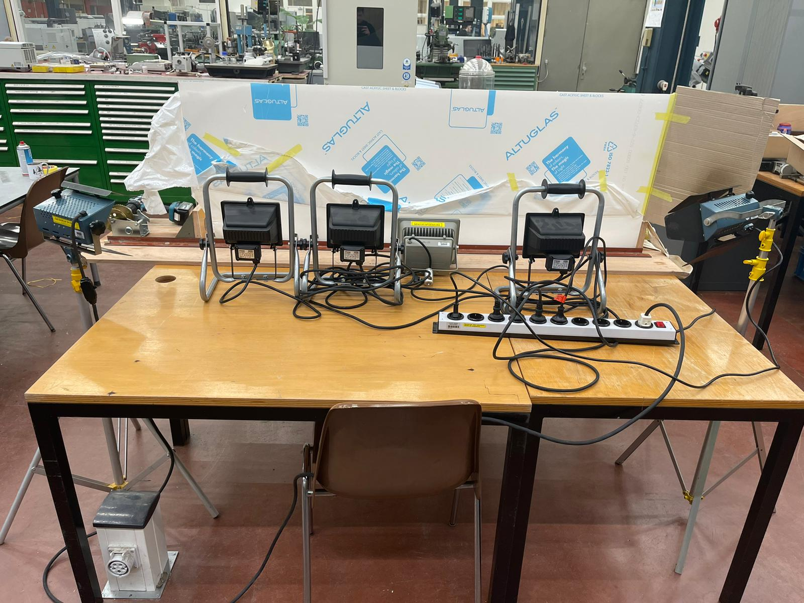

- Spray the insides of the tube with generous amounts of oil for the best seal (shown in the picture).

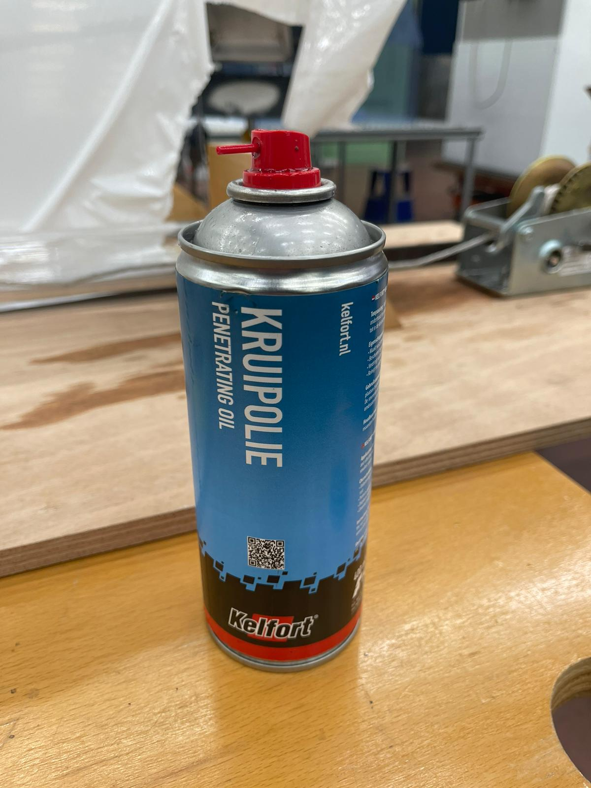

- Follow the instructions shown in the video in order to prepare the cannon for firing.

- Unspool and tow the line with the magnets stuck to the winch
- Attach the piston to the line and place it in the tube
- Firmly place the ball on the sticky end of the piston and slowly pull on the line or turn the winch until the ball is just inside the end of the cannon. The closer to the end the ball is the better the vacuum will be.

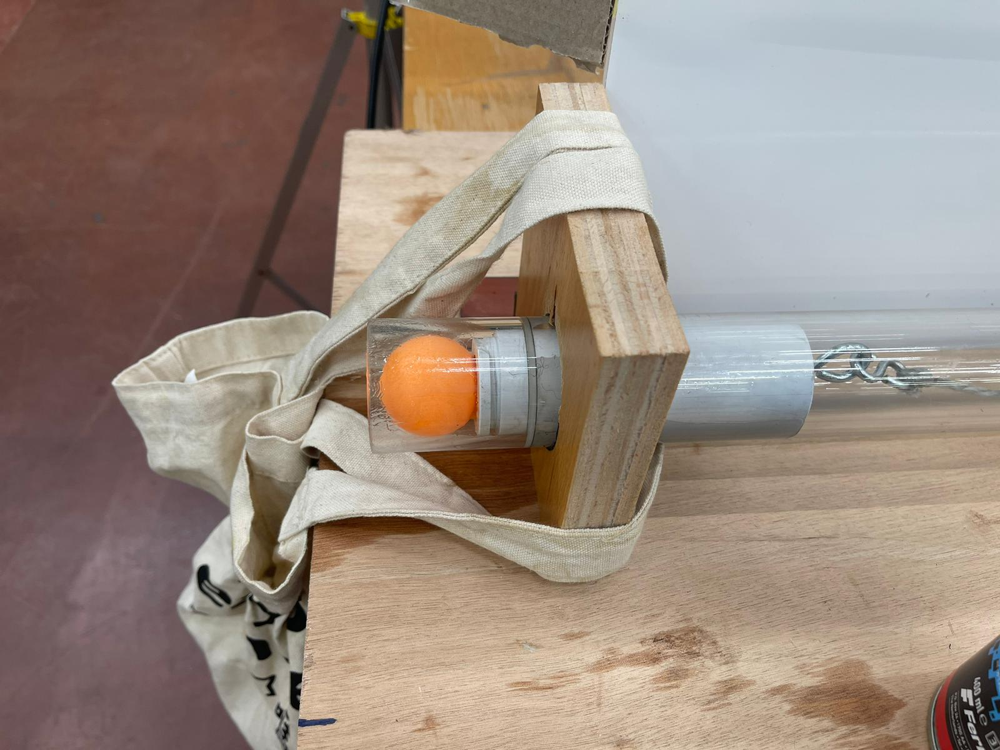

- Ensure that the line feeds to the top of the winch's drum:

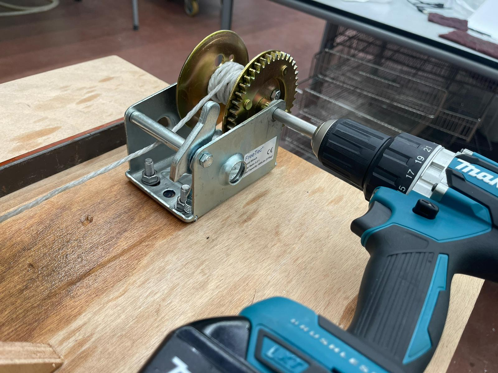

- Make the burst seal as shown in the video, the grease used is in the picture below.

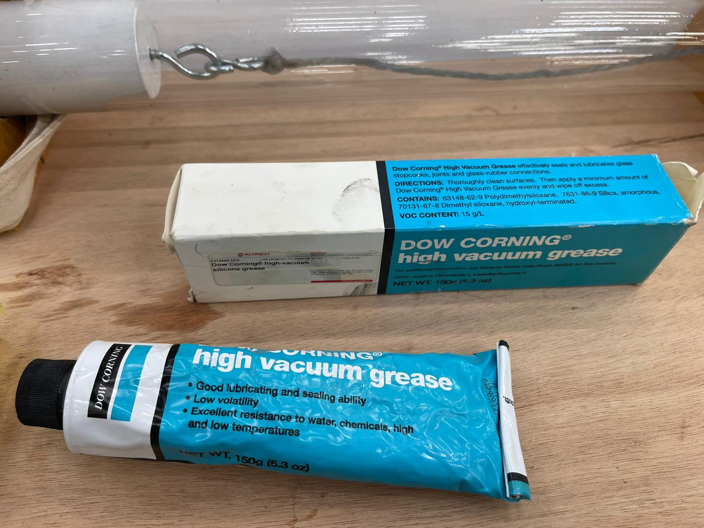

- Place the bag on the end of the cannon and ziptie it (to undo the ziptie follow the Tutorial video, place a flat screwdriver where the ziptie is locked and undo it)

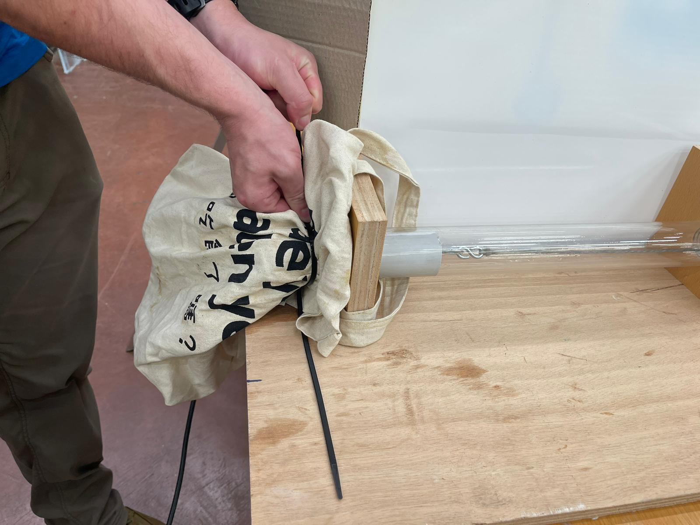

- Connect the drill to the winch, ensuring the chuck is nice and tight.

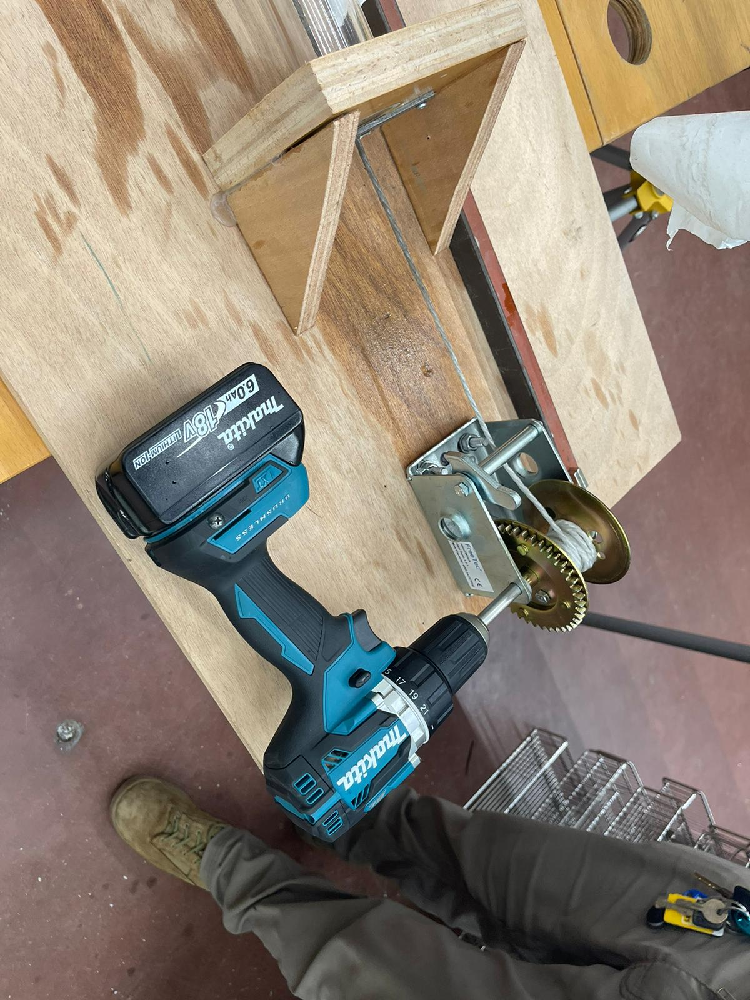

- Ensure the drill is in 'drilling mode' as shown:

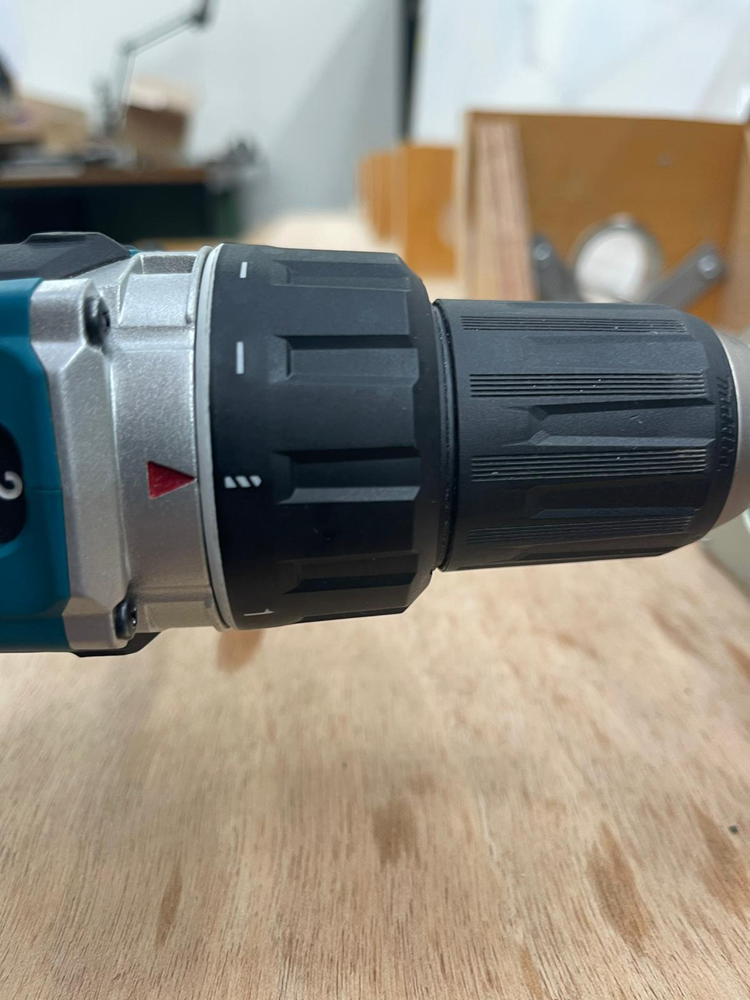

- Place the camera on a tripod or platform approximately level with the cannon so it can see the entire length of the tube.

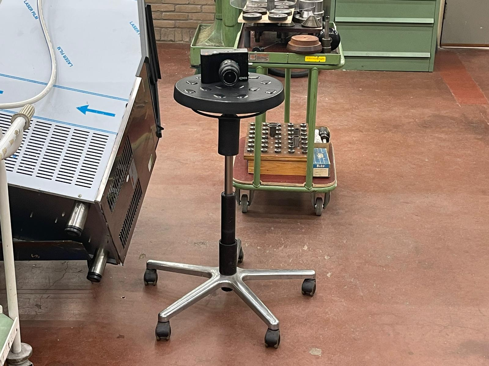
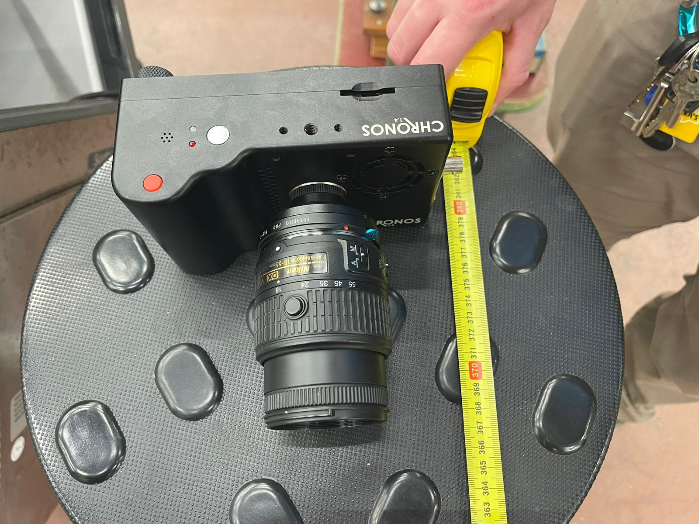

### Camera

- Turn on the camera by pressing the power button and wait for it to boot
- If it does not power on or dies, the charger can be found in the experiment equipment box
- When it is on go to Record settings (at the top right corner) and change the framerate to 8000 (in the Record settings botom left), press OK
- Aim the camera at the camera at the cannon so that it can see the whole tube
- To start the recording press the Big Red Button on the camera, to stop it press it again (if you want to test it you can, just restart the camera for the real shot to start with free memory, as it will ask you for confirmation to overwrite it and ruin your data collection)
- To save the video after taking it go to Play (option on the right side of the screen), insert the USB sitck from the "Trey" box into the ESATA/USB port on the side, press settings in the Play menu to ensure that it sees the drive, exit settings, press Save and wait for the process to finish (Red verical line will change to green), safely remove the USB (Play->Settings)
- Ensure that data is saved and turn off the camera to save battery

### Fire

- **GET PERMISSION TO FIRE.** It *will* scare people in LPL.
- Check that the drill will rotate clockwise with a quick squeeze of the trigger.
- Ensure the camera is on.
- Turn on the lights.
- Ensure camera sees what you want (you can focus the lense and change the aparature(how much light it gets)).
- Warn people that you are firing.
- Press the camera's record button.
- Hold the drill's trigger down and enjoy.

$`\textcolor{red}{\text{Bang!!!}}`$

- Quickly stop the recording, the camera will fill the RAM in seconds
- Turn off the lights
- Save the video to USB
- Transfer the video to computer for analysis

### Software
- Download Tracker from: https://physlets.org/tracker/
- Open Tracker
- Upload video on Tracker by selecting Open File Chooser and navigating to the file.

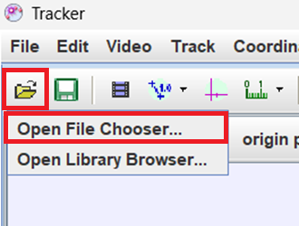

- Move the slider to the frame where the ball enters the image, select Set start frame to the slider, then similarly set end frame to the frame ball leaves the frame of the video.

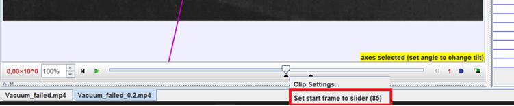

- Select Calibration Stick

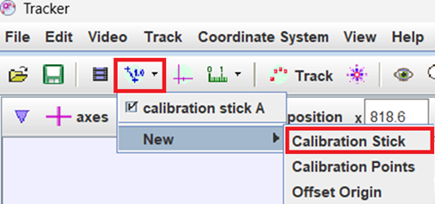

- Drag the ends of the calibration stick to some place of the experimental setup which length is known and set the length on the calibration stick in meters.
- Select Track -> New -> Point Mass, then edit the mass to 0.0027.

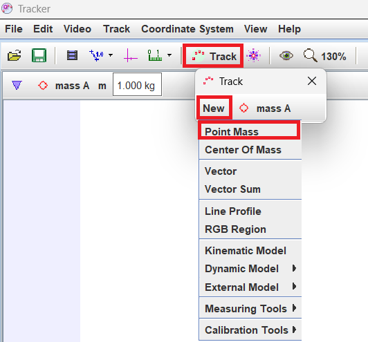

- In the frame where the ball is visible press Shift + Ctrl + Left click (on the approximate centre of the ball). A window will pop out. Select Search (This will search for your selected object in the selected range of frames)

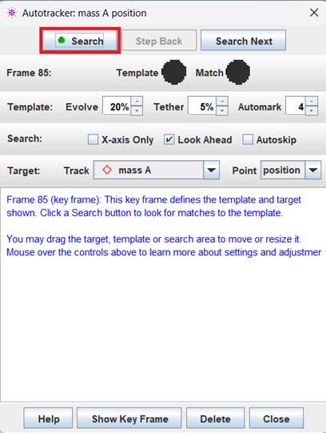

- The software may miss the ball, the marks then need to be dragged to where the ball is in that frame (select the frame you want with the slider) if the ball is not detected at all Shift + Ctrl + Left click on its location.
- A table will appear in the lower right corner, select Columns and check column "v" to see the velocity.

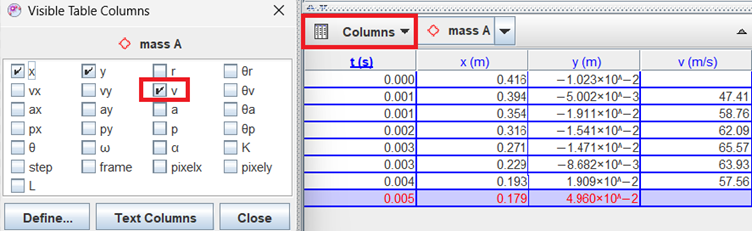

- If you see any time values that are the same in the table, right-click on the table and press on formats.

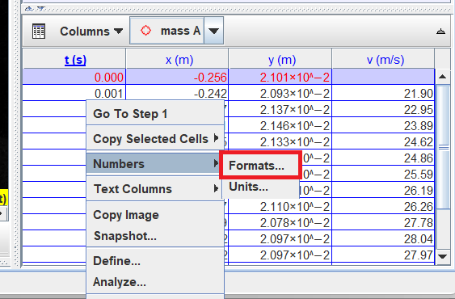

- It will open the window shown below, make sure time value is selected as shown and change the Format to 0.000 add as many zeros after the decimal point as needed to make time values in the table different (the table updates real-time so it is not difficult to tell how many are needed).

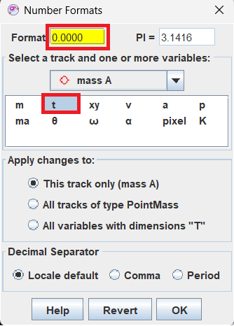

- Export the data:

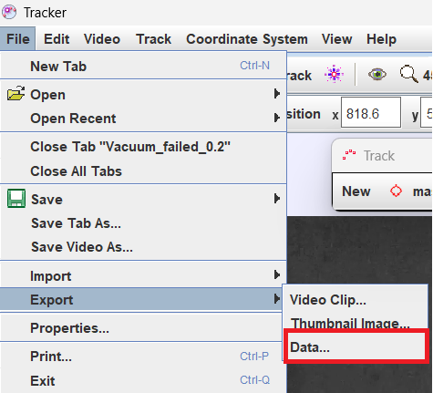

- Select columns and thick boxes that are selected in the picture: 

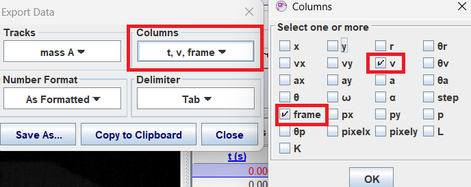

- Change the delimiter to comma.

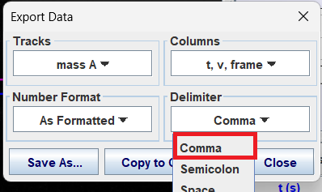

- Finish it by clicking Save As… and saving it as .txt.

Python analysis. 
- Drop the data file into the folder with the [Python code](https://git.science.uu.nl/ued2023/ued2023/-/blob/mantas/projects/VacuumCannon_MantasMatthijsTrey/Data_analysis.py) provided in GitLab. 
- Change the txt variable with the name of the data file.
- Run the code and the .png format files should be deposited in the code folder with the plots for Velocity vs time and Velocity vs frames.

# Results
## Data

We obtained some data from a misfire and analysed it, the results are in the [Data1](Data/V1.txt) and [Data2](Data/V2.txt).txt file.

- Velocity as a function of time.

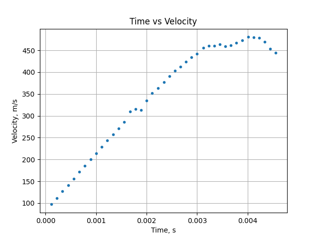

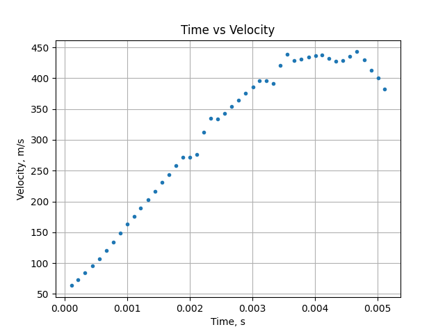

- Videos of the shots

The maximum velocity of the first set of data is around 470 m/s, where as the second set has around 450 m/s.

<!--
Luckily a misfire of a vacuum cannon only leads to underperformance, reducing danger, the opposite of regular explosive propellant cannons. There are many different ways the cannon can misfire, including a leaky or prematurely broken seal, a loose ball that doesn't stick and travel with the piston to the back of the cannon, or a stuck piston that stays in the entrance of the tube to restrict the flow of air into the barrel.
-->

<!--
# Usage
Use examples liberally, and show the expected output if you can. It's helpful to have inline the smallest example of usage that you can demonstrate, while providing links to more sophisticated examples if they are too long to reasonably include in the README.

# Support
Tell people where they can go to for help. It can be any combination of an issue tracker, a chat room, an email address, etc.

# Roadmap
If you have ideas for releases in the future, it is a good idea to list them in the README.

# Contributing
State if you are open to contributions and what your requirements are for accepting them.

For people who want to make changes to your project, it's helpful to have some documentation on how to get started. Perhaps there is a script that they should run or some environment variables that they need to set. Make these steps explicit. These instructions could also be useful to your future self.

You can also document commands to lint the code or run tests. These steps help to ensure high code quality and reduce the likelihood that the changes inadvertently break something. Having instructions for running tests is especially helpful if it requires external setup, such as starting a Selenium server for testing in a browser.
-->

# Authors and acknowledgment
This cannon was created for Utrecht Uni's Experiment Design course, taught by Sanli Faez, as part of the Authors' MSc courses. It could not have been built without the help, expertise, equipment, and craftsmanship from the fine people at Lili's Proto Lab, including – but not limited to – Otto van de Beek, Pieter Kooijman, Rudi Borkus, and Vin from NPEC.

The inspiration is from Prof. Em. & Prof Eric Ayars's work on Vacuum cannons in 2005. Dr. Buchholtz continued to develop the math, culminating in the publishing of a book, [On the trail of Blackbody radiation](https://a.co/d/4JJKZKK)

# License
[CC BY-NC-SA](https://creativecommons.org/licenses/by-nc-sa/4.0/) has penetrated from [NightHawkInLight's work on Instructables.](https://www.instructables.com/Rapid-Reload-Vacuum-Cannon-Magnetic-Piston-No-Burs/)

# Project status
A member of our dev team has fallen ill and therefore our camera trigger isn't completed, requiring the manual activation of the camera.

